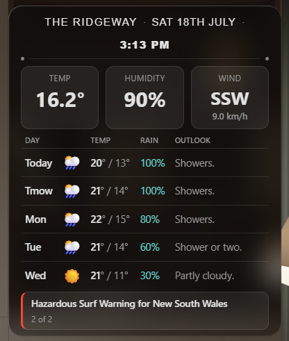
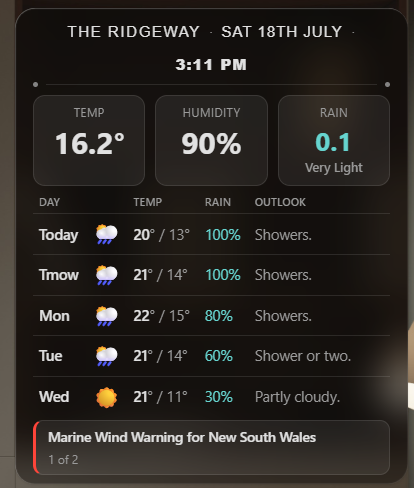
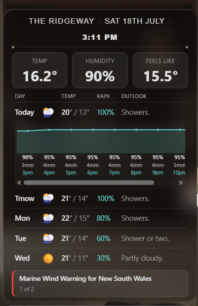
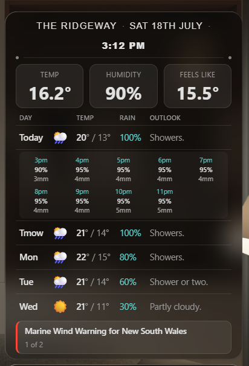

# WeatherFlow + BOM Weather Card for Home Assistant

A custom Lovelace card for Australian Home Assistant users running a **WeatherFlow (Tempest)** weather station alongside a **Bureau of Meteorology (BOM)** weather integration. Combines live station readings with BOM's 5-day forecast and hourly rain probability into one compact card, with a tap-to-expand scrollable rain graph.



## Features

### Box 1 / Box 2 — Temp & Humidity

Live temperature and humidity from your WeatherFlow station, falling back to BOM data if the station goes offline. These update reactively, immediately reflecting whatever your WeatherFlow station's own sensors report — there's no polling interval controlled by this card, it just re-renders the instant the underlying entity changes.

### Box 3 — Auto-priority reading, tap to cycle manually

Box 3 automatically shows whichever condition is most relevant right now, in priority order — a genuine extreme (high wind gust, extreme rain, extreme lightning, extreme UV, or a large feels-like gap) always outranks a merely-active non-extreme condition, which in turn outranks the wind/feels-like default. Extremes get a pulsing indicator. Like boxes 1/2, this recomputes reactively whenever the underlying condition changes — it isn't on a timer.



**Tap Box 3** to manually cycle through readings instead: **wind → rain → lightning → UV → feels-like → wind → ...**. Wind and feels-like are always available to tap to; rain, lightning, and UV are automatically **skipped from the cycle whenever their value is currently inactive/zero** (e.g. no lightning strikes right now), so a tap never lands you on an empty "0" reading. A manual selection reverts to auto after 1 minute of inactivity, on a **double tap**, or immediately if a genuinely new condition becomes active while you're viewing a manual pin.

### 5-day forecast + hourly rain graph

A 5-day forecast table sourced from BOM, with day labels derived from each forecast entity's own date (not sensitive to BOM's forecast-reissue timing). The 5-day rows' own refresh cadence follows your BOM integration's own polling settings — this card doesn't control that. The card's own hourly-rain re-fetch (`weather.get_forecasts`, used for the tappable graph below) runs on a fixed 5-minute schedule plus once at Home Assistant startup, independent of your BOM integration's general polling.

Tap on Today or Tomorrow (when rain is forecast) to expand an inline, horizontally-scrollable hourly rain graph — smoothed curve, probability/mm/time labels.



**Scrolling:** the graph covers the full day (24 hours for Tomorrow; Today only ever has hours from "now" onward, since forecast data is forward-looking, not historical). On first expand it auto-scrolls so the *current* hour sits centered in the visible viewport — for Today this naturally can't be a true center (there's nothing earlier than "now" to center against), so it opens at its leftmost hour instead; Tomorrow centers properly with hours visible on both sides. From there it's a free horizontal scroll/swipe, no snapping to hour boundaries. Scrolling resets a 3-minute auto-collapse timer, so actively browsing the graph never gets cut off mid-swipe — a panel left untouched for 3 minutes collapses on its own.

Tap the graph to switch to a raw numeric grid instead; tap that to collapse, or double-tap the graph to collapse directly. **Tapping the day row's header itself (Today/Tmow) while it's already expanded does the same thing** as tapping the content below it — no dead spot if you naturally tap the row again instead of the graph/grid.



### Warnings footer

A footer strip surfaces any active BOM warnings for your configured location (`dash4_bom_prefix`) — red left-border while a warning's active, tap it to cycle through multiple warnings one at a time if there's more than one ("1 of 2" etc., merged onto the title line when there's room). When nothing's active, it falls back to showing today's plain BOM outlook text instead, no red border.

**No character limit or truncation:** the footer shows BOM's warning title text in full, however long it is — no max-height, no ellipsis, no cutting the string short. A long warning title just wraps across as many lines as it needs, and the card grows to fit (same "size to actual content, not a fixed height" approach used throughout this card).

**Where the wording comes from, and why it can vary in specificity:** this footer shows BOM's own warning title text verbatim — the card doesn't filter, summarize, or rewrite it. Your BOM integration was set up pointing at a specific location, and BOM's own backend checks that location against *all* of its warning zone types independently (marine districts, severe weather forecast districts, fire danger areas, flood districts, heatwave zones, etc.) — each zone type is drawn with completely different boundaries for its own purpose, so a single point can simultaneously sit inside a broad marine zone, a differently-shaped severe-weather district, and so on. BOM's API returns whatever's currently active for *any* zone containing that point, and the title wording it uses is entirely up to BOM and varies by warning type: some are worded at state level ("... for New South Wales"), others name a specific forecast district by name. Which one you see at any moment depends purely on which BOM zone type happens to have something active right now — not something this card controls or can normalize, since it's just displaying whatever text BOM's API provides for your own configured location.

## Prerequisites

- A **WeatherFlow Tempest** weather station, set up via Home Assistant's WeatherFlow integration
- A **BOM (Bureau of Meteorology)** weather integration that exposes both a main `weather.*` entity (daily forecast) and a corresponding hourly-capable entity, plus per-day-index forecast sensors (temp max/min, rain chance, short text outlook) alongside it

## Installation

### 1. The card (via HACS)

Add this repository as a HACS custom repository (category: **Dashboard**), then install "WeatherFlow + BOM Weather Card." This installs `ha-weatherflow-bom-weathercard.js` as a Lovelace resource automatically.

Alternatively, copy `dist/ha-weatherflow-bom-weathercard.js` into your own `config/www/` folder and add it manually as a Lovelace resource (Settings → Dashboards → Resources → Add Resource, type: JavaScript Module). The internal card tag stays `custom:dash4-weather-card` either way (see step 3) — only the distributed filename changed, to satisfy HACS's naming convention.

### 2. The data layer (manual copy — HACS can't install arbitrary YAML packages)

Copy these YAML files into your `config/packages/` folder:
- `packages/dash4_weather_card.yaml` — required
- `packages/dash4_public_config.yaml` — required
- `packages/dash4_box3_interaction.yaml` — optional, only needed if you want Box 3's tap-to-cycle behavior (see above); the card works fine without it, Box 3 just won't respond to taps

Edit `dash4_public_config.yaml`'s two `initial:` values before restarting:
- `dash4_weatherflow_prefix`: your WeatherFlow station's entity prefix. Find it by checking any of your station's sensors, e.g. `sensor.<this>_temperature` — the part between `sensor.` and `_temperature` is your prefix.
- `dash4_bom_prefix`: your BOM location's entity prefix. Find it via your `weather.<this>` entity, or the `sensor.<this>_temp_max_0`-style forecast sensors your BOM integration creates.

Restart Home Assistant (new `input_text`/`input_select`/`timer` helpers require a restart to appear).

### 3. Add the card to a dashboard

```yaml
type: custom:dash4-weather-card
entity: sensor.dash4_weather_card
uv_entity: sensor.<your_weatherflow_prefix>_uv_index
place_name: "YOUR HOUSE NAME"
```

`entity` defaults to `sensor.dash4_weather_card` if omitted (matching this package's sensor name — only change it if you renamed the sensor). `uv_entity` has no safe default — set it to your own station's UV sensor, or leave it unset if you don't want the UV reading. `place_name` defaults to `"MY HOME"` if omitted.

## Numeral colors, thresholds & pulsing

Box 1 (temperature) and Box 3 (whichever reading is showing) can each render in one of three states: **neutral** (default color), **solid accent color** (a condition worth noting), or **pulsing accent color** (a genuine extreme). The exact triggers:

**Box 1 — actual temperature:**
| Range | Color | Pulsing? |
|---|---|---|
| ≥ 35°C | Red | Always |
| 30–34.9°C | Red | Only if a matching BOM heat warning is active; otherwise solid |
| 14–29.9°C | (neutral) | — |
| 10–13.9°C | Blue | Only if a matching BOM frost/grazier/cold warning is active; otherwise solid |
| < 10°C | Blue | Always |

The temperature value itself always prefers your **local WeatherFlow station** — BOM only supplies the number when the station is offline (see Box 1/Box 2 above). The 30–34.9°C / 10–13.9°C bands are a deliberate "not quite extreme yet" tier, and the BOM-warning check that can escalate them to pulsing is a **separate, independent lookup** (BOM's own severe-weather-warnings feed) — it runs the same way regardless of whether the current temperature came from the station or from BOM fallback, it is not conditional on the station being offline. So the expected, correct behavior in *either* case (station online or offline) is: pulsing only when a genuine official warning is active; solid otherwise. A station outage with no matching BOM warning correctly shows solid, not pulsing — that's intended, not a gap.

**Box 3 — feels-like vs. actual gap** (used for the "feels hotter/colder than actual" reading): the gap threshold needed to flag as notable *shrinks* as the actual temperature gets more extreme in that direction —
- Feels **colder**: actual 19–23°C needs a >4°C gap; 15–19°C needs ≥3°C; 10–15°C needs ≥2°C; ≤10°C needs only ≥1°C.
- Feels **hotter**: actual 25–30°C needs ≥3°C gap; 30–35°C needs ≥2°C; >35°C needs only ≥1°C.
- Escalates to pulsing red/blue under the same ≥35°C / <10°C actual-temperature rule as Box 1 above; otherwise solid.

**Box 3 — other extreme thresholds:** wind gust ≥ 60 km/h · rain intensity reported as "extreme" AND rain rate > 0 · lightning ≥ 10 strikes in the last hour · UV index ≥ 11. All pulse red when triggered. Rain (non-extreme, just currently active) shows solid teal; lightning (non-extreme, just currently active) shows solid amber — these two have no "extreme-only" variant of their base color, they either show their accent color or don't show at all.

**Multi-extreme border:** if 2 or more of the 6 extreme flags (feels-colder, feels-hotter, high wind, rain, lightning, UV) are true at once, Box 3's whole border pulses amber as an additional "multiple things going on" signal, on top of whichever single reading is currently selected.

## Theming

The card's base layout (background, blur, text colors, dividers) follows your active Home Assistant theme automatically via standard HA CSS variables. The accent colors (rain teal, lightning amber, hot/cold red/blue, and the hourly graph's line/area) are fixed, not theme-derived — a deliberate design choice, not a bug.

## Notes

- Only Today and Tomorrow's forecast rows are ever tappable for the hourly graph — BOM's hourly forecast data reliably covers roughly the next 48 hours only.
- The card has no config-flow UI; all configuration is via the YAML shown above and the two `input_text` helpers.

## License

MIT — see [LICENSE](LICENSE).
