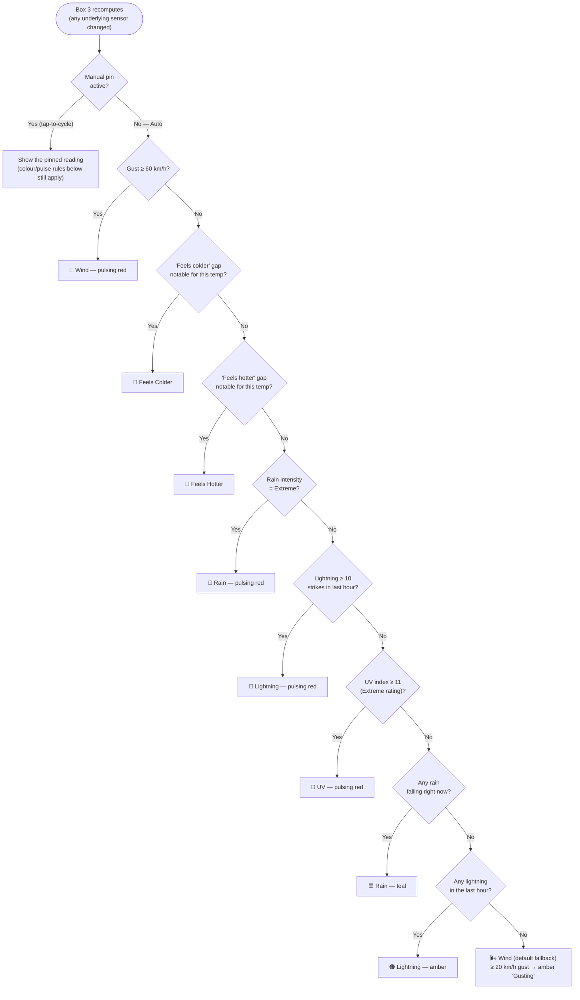

# Box 3 — How the Auto-Priority Reading Works

Box 3 shows one reading at a time out of seven possible metrics (Wind, Rain,
Lightning, UV, and three Feels-Like variants). In **Auto** mode it picks
whichever one is most worth your attention right now, using a fixed priority
order re-evaluated every time any underlying sensor changes — there's no
polling interval or hold timer involved in the *selection* itself.

## The priority cascade

Every box below `P1` only gets checked if everything above it was `No` — so a
genuine extreme (say, a 65 km/h gust) always wins over a merely-active
condition (say, light rain), no matter which order they started or how long
either has been going. Wind is the only metric with **no** "merely active"
tier at all: a 35 km/h gust (notable, but under the 60 km/h extreme cutoff)
will never outrank active rain or lightning on its own — it only ever shows
up as the extreme case at the top, or as the fallback at the bottom. To see a
non-extreme elevated wind reading you'd tap to it manually.

## Reference table

| Metric | "Merely active" condition | "Extreme" condition | Colour (active) | Colour (extreme) |
|---|---|---|---|---|
| Wind | *(none — see note above)* | Gust ≥ 60 km/h | — | 🔴 Red, pulsing |
| Feels Colder | *(same as extreme — single threshold)* | Gap below actual temp exceeds a sliding scale (see below) | — | 🔵 Blue (pulses only if actual < 10°C) |
| Feels Hotter | *(same as extreme — single threshold)* | Gap above actual temp exceeds a sliding scale (see below) | — | 🟠 Amber at 27–29.9°C, then 🔴 Red from 30°C (pulses only if actual ≥ 35°C) — see note below |
| Rain | Any measurable rain (rate > 0 with a real intensity descriptor) | WeatherFlow's own "Extreme" intensity descriptor | 🟦 Teal | 🔴 Red, pulsing |
| Lightning | ≥ 1 strike in the last hour | ≥ 10 strikes in the last hour | 🟠 Amber | 🔴 Red, pulsing |
| UV | *(same as extreme — single threshold)* | Index ≥ 11 (standard "Extreme" UV rating) | — | 🔴 Red, pulsing |

**Two separate things use similar-sounding thresholds for Feels Colder/Hotter
— don't conflate them.** The sliding-scale gap table just below decides
*whether Box 3 auto-selects* a Feels Colder/Hotter reading at all (a
priority-cascade decision, covered by this whole guide). Completely
separately, once a Feels Colder/Hotter reading **is** showing (auto-selected
or manually tapped to), its number is coloured using the *actual/feels-like
temperature's own value* against a fixed set of bands (added 2026-07-19: an
amber "notable" tier at 27–29.9°C now sits between neutral and the existing
solid-red 30–34.9°C tier) — see the main README's "Numeral colours,
thresholds & pulsing" section for that full table. A reading can be
auto-selected via the gap logic while still rendering in *any* colour
(including neutral) depending on where the raw number itself happens to
land — the two systems don't share thresholds or logic.

**Feels Colder/Hotter's sliding-scale gap** — the colder or hotter it already
is, the smaller an extra gap counts as "notable" (a 1° chill matters more at
5°C than at 20°C):

| Actual temp | Feels-colder trigger | | Actual temp | Feels-hotter trigger |
|---|---|---|---|---|
| ≤ 10°C | feels ≥1° colder | | > 35°C | feels ≥1° hotter |
| 10–15°C | feels ≥2° colder | | 30–35°C | feels ≥2° hotter |
| 15–19°C | feels ≥3° colder | | 25–30°C | feels ≥3° hotter |
| 19–23°C | feels >4° colder | | | |

There's a **dead zone between 23°C and 25°C** where neither can ever trigger,
regardless of the gap — an intentional side effect of the two scales not
quite meeting in the middle, left as-is since that band rarely produces a
meaningfully "notable" feels-like gap either direction anyway.

**Feels Colder/Hotter only has one threshold, not two** — unlike Rain and
Lightning, there's no separate "mildly colder than usual" tier below the
table above; the gap either clears the bar for that temperature band or it
doesn't. In the underlying template this condition is technically listed in
both the extreme-priority and normal-priority checklists (a duplication of
the code, not the behaviour) — since it's the same flag both times, it can
only ever be caught by the first (extreme) check, so the second listing
never actually fires. Same story for UV. Rain and Lightning are the only two
metrics that genuinely have two different flags/severity levels.

**BOM warnings affect colour, not selection.** A BOM Sheep Graziers /
Frost / Heatwave warning can push an *already-showing* Feels Colder/Hotter
reading straight to its pulsing variant, even if the numeric gap alone
wouldn't have crossed the strict <10°C / ≥35°C pulse threshold. It does
**not** make Box 3 auto-select Feels Colder/Hotter in the first place — that
decision is driven only by the gap table above, independent of any active
BOM warning.

## The border pulse is a separate signal

Box 3 can only display one reading at a time, but a small amber **border**
pulse appears whenever **2 or more** of the six extreme conditions above are
true *simultaneously* — even though you're only looking at whichever one won
the priority race. It's the card's way of saying "there's more than one
extreme thing happening right now, not just the one you're currently
looking at."

## Manual tap-cycle

Tap Box 3 to step through readings yourself instead of trusting Auto:

**wind → rain → lightning → UV → feels-like → wind → ...**

Wind and Feels-Like are always reachable; Rain, Lightning, and UV are
automatically skipped in the cycle whenever they're currently inactive/zero,
so a tap never lands you on an empty "0 strikes" reading. All the same
colour/pulse rules from the table above still apply to whatever you've
manually pinned. A manual pin reverts to Auto after 1 minute of inactivity,
on a double-tap, or immediately if a genuinely new extreme condition becomes
active while you're viewing something else.
